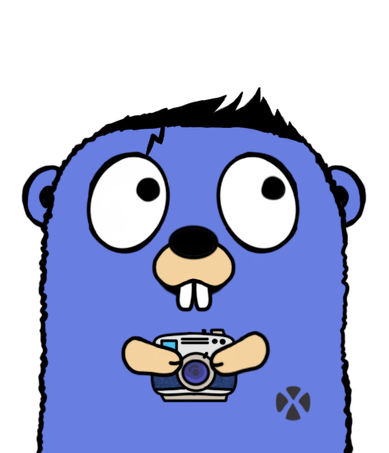

<p style="text-align:center; margin: 0 auto;">
    
</p>

# UGO SPECTATOR
## _The only file watcher you will ever need_

## Installation
```shell script
go get github.com/ugo-framework/ugo-spectator
```

Then use it in your code use the following sysntax
```go
package examples

import 	ugo "github.com/ugo-framework/ugo-spectator"

watcher, err := ugo.Init("..")
if err != nil {
    // Handle Error
}
err = watcher.Close()
if err != nil {
    // Handle Error
}
```
The full example can be viewed [here](./examples/example.go)
This documentation is not Complete and still in its early stages
